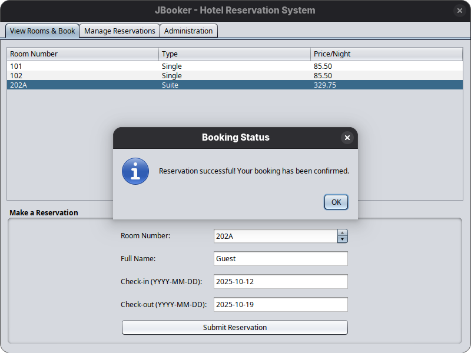
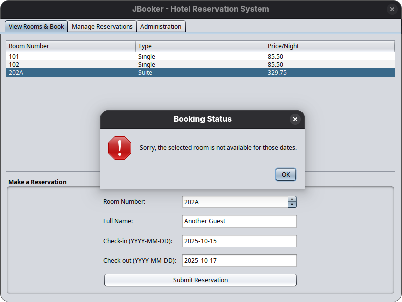
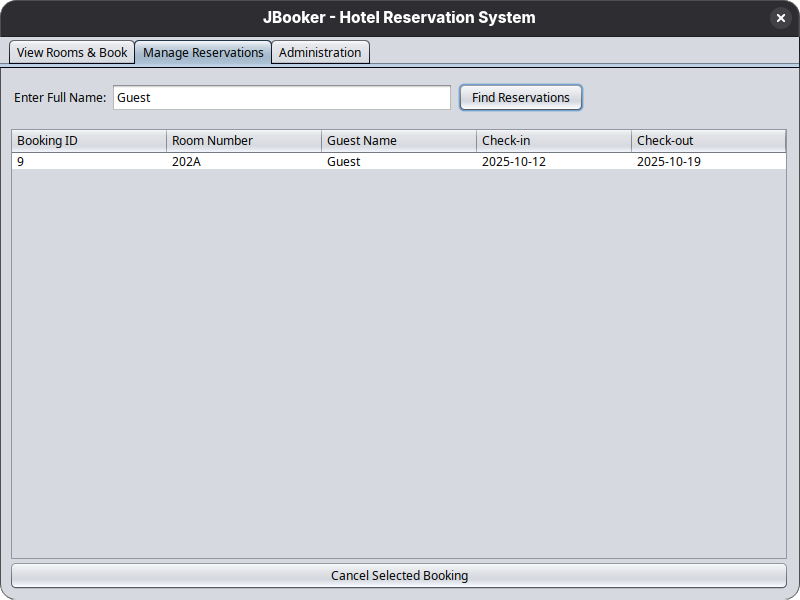
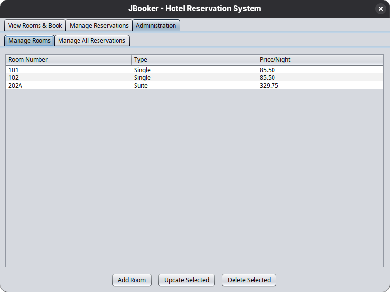
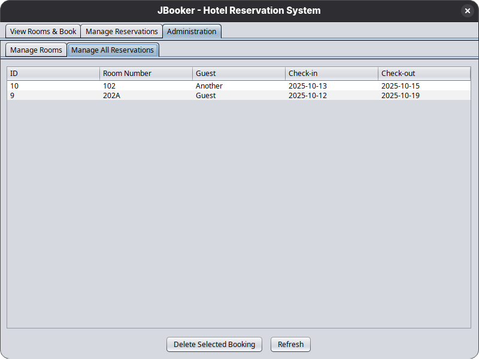

# 🏨 JBooker: Hotel Reservation System (CLI & GUI)

JBooker is a complete, command-line and graphical-based hotel reservation system written in Java. This project is
designed to showcase a strong understanding of Object-Oriented Programming (OOP) principles, multi-layered application
architecture, and modern Java development practices.

---

<p align="center">
  <b>Enjoying the project? Please consider giving it a ⭐ on GitHub!</b>
</p>

---

## 📸 Screenshots

Here is a showcase of the application's user interface.

| Menu                  | Screenshots                                                                                    |
|:----------------------|:-----------------------------------------------------------------------------------------------|
| Reservation (Success) |                   |
| Reservation (Fail)    |  |
| Manage Reservations   |                   |
| Admin (Rooms)         |                     |
| Admin (Reservations)  |          |

---

## ✨ Features

The application supports all the core functionalities required for a hotel management system, accessible via both a
Command-Line Interface (CLI) and a Graphical User Interface (GUI).

### User Features

* **View Available Rooms:** Display a clean, formatted list of all rooms, including their type and price per night.
* **Make a Reservation:** Book a room for a specific date range, with validation to prevent double-booking.
* **View & Cancel Bookings:** Search for existing bookings by guest name and cancel them.

### Administrative Features

* **Room Management:** A dedicated admin menu to perform CRUD (Create, Read, Update, Delete) operations on rooms.
* **Dynamic Data:** Add, update, or remove rooms from the hotel's inventory in real-time.

---

## 🛠️ Tech Stack & Architecture

This project was built using industry-standard tools and a professional architectural pattern to ensure the code is
maintainable, scalable, and testable.

* **Language:** `Java`
* **Build Tool:** `Maven`
* **Database:** `SQLite`
* **GUI:** `Java Swing`
* **Testing:** `JUnit`
* **Utilities:** `Lombok`

### Application Architecture

The system is built on a classic 3-tier architecture, which separates the application's concerns into distinct layers. This is a core concept in modern software engineering.

```

┌───────────────────┐
│ Presentation Layer│ (cli / gui)
└─────────┬─────────┘
          │
┌─────────▼─────────┐
│   Service Layer   │ (Business Logic)
└─────────┬─────────┘
          │
┌─────────▼─────────┐
│ Data Access Layer │ (Database Queries)
└─────────┬─────────┘
          │
┌─────────▼─────────┐
│     Database      │ (SQLite)
└───────────────────┘

```

---

## 🏛️ Project & Database Structure

### Database Structure

The application uses an SQLite database file (`jbooker.db`) which is created automatically in the root directory. The database consists of two main tables: `rooms` and `bookings`.

**Table: `rooms`**
Stores the details for each hotel room.

| Column | Type   | Constraints     | Description             |
| :----- | :----- | :-------------- | :---------------------- |
| `number` | `TEXT` | **PRIMARY KEY** | The unique room number. |
| `type`   | `TEXT` | `NOT NULL`      | The type of the room.   |
| `price`  | `REAL` | `NOT NULL`      | The price per night.    |

**Table: `bookings`**
Stores reservation information.

| Column           | Type      | Constraints             | Description                                |
| :--------------- | :-------- | :---------------------- | :----------------------------------------- |
| `id`             | `INTEGER` | **PRIMARY KEY AUTOINC** | The unique identifier for the booking.     |
| `room_number`    | `TEXT`    | `NOT NULL`              | A foreign key referencing `rooms(number)`. |
| `guest_name`     | `TEXT`    | `NOT NULL`              | The full name of the guest.                |
| `check_in_date`  | `TEXT`    | `NOT NULL`              | The check-in date (YYYY-MM-DD).            |
| `check_out_date` | `TEXT`    | `NOT NULL`              | The check-out date (YYYY-MM-DD).           |

### Project Directory Organization

The project's source code is organized into packages based on the application's layers and responsibilities.

```

src/main/java/io/github/ztrahmet/jbooker/
├── cli/          # Presentation Layer: Contains classes for the Command-Line Interface.
├── data/         # Data Access Layer: Manages database connections and SQL queries.
├── gui/          # Presentation Layer: Contains classes for the Swing Graphical User Interface.
├── model/        # Model Layer: Defines the core data objects (POJOs) like Room and Booking.
├── service/      # Service Layer: Contains business logic, validation, and coordinates data flow.
└── Main.java     # The main entry point for the application.

```

---

## 🚀 Getting Started

### Prerequisites

* Java JDK 17 or higher
* Apache Maven

### How to Build

1.  Clone the repository:
    ```bash
    git clone https://github.com/ztrahmet/jbooker.git
    ```
2.  Navigate to the project directory:
    ```bash
    cd jbooker
    ```
3.  Build the project and create the executable JAR file:
    ```bash
    mvn clean package
    ```
    This will create a `jbooker-1.0-SNAPSHOT.jar` file in the `target` directory.

### How to Run

The application can be launched in two different modes from the command line.

* **To run the GUI (default mode):**
    ```bash
    java -jar target/jbooker-1.0-SNAPSHOT.jar
    ```
* **To run the CLI:**
    ```bash
    java -jar target/jbooker-1.0-SNAPSHOT.jar cli
    ```

The `jbooker.db` database file will be created automatically in the root directory on the first run.
